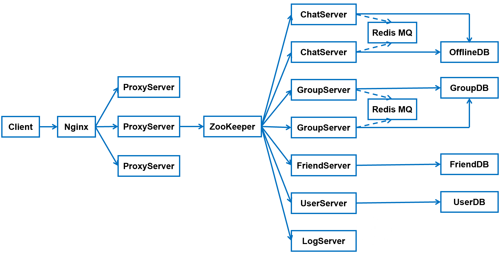

# Distributed_Chat_System
简介：工作在nginx tcp负载均衡/一致性哈希负载均衡环境中的集群聊天服务器和客户端, 网络模块基于muduo实现，基于protobuf和zookeeper实现的RPC框架来完成分布式通信。

**整体框架：**


## 聊天业务
```
    {"help", "显示所有支持的命令，格式 help"},
    {"chat", "一对一聊天，格式 chat:friendid:message"},
    {"addfriend", "添加好友，格式 addfriend:friendid"},
    {"delfriend", "删除好友，格式 delfriend:friendid"},
    {"creategroup", "创建群组，格式 creategroup:groupname:groupdesc"},
    {"addgroup", "加入群组，格式 addgroup:groupid"},
    {"delgroup", "删除群组，格式 delgroup:groupid"},
    {"groupchat", "群聊，格式 groupchat:groupid:message"},
    {"showfriendlist", "显示好友列表，格式 showfriendlist"},
    {"loginout", "注销，格式 loginout"}
```

## 表的设计
### user表


### friend表


### offlinemessage表


### allgroup表


### groupuser表


## RPC架构设计


- **Caller**: 将请求方法和请求参数经过**序列化**之后，通过网络模块发送给被调用方Callee；将接收到的服务调用结果**反序列化**
- **Callee**: 将接受的请求方法和参数**反序列化**之后，计算方法调用结果；将结果**序列化**之后，通过网络模块发送给Caller

- **黄色部分**: 设计rpc方法参数的打包和解析,也就是数据的序列化和反序列化,使用Protobuf。
- **绿色部分**: 网络部分,包括寻找rpc服务主机,发起rpc调用请求和响应rpc调用结果,使用muduo网络库和zookeeper服务配置中心。

### rpc服务提供方
``` c++
  class UserServiceRpc : public ::PROTOBUF_NAMESPACE_ID::Service
  // 这两个方法是纯虚函数，作为基类
  virtual void Login(::PROTOBUF_NAMESPACE_ID::RpcController* controller,
                       const ::fixbug::LoginRequest* request,
                       ::fixbug::LoginResponse* response,
                       ::google::protobuf::Closure* done);

  virtual void GetFriendLists(::PROTOBUF_NAMESPACE_ID::RpcController* controller,
                       const ::fixbug::GetFriendListsRequest* request,
                       ::fixbug::GetFriendListsResponse* response,
                       ::google::protobuf::Closure* done);

  const ::PROTOBUF_NAMESPACE_ID::ServiceDescriptor* GetDescriptor();
```

### rpc服务消费方
``` c++
  class UserServiceRpc_Stub : public UserServiceRpc
  // 庄类，其输入是一个RpcChannel类对象
  UserServiceRpc_Stub(::PROTOBUF_NAMESPACE_ID::RpcChannel* channel);
  //　rpc服务提供方基类的派生类，重写这两种函数
  void Login(::PROTOBUF_NAMESPACE_ID::RpcController* controller,
                       const ::fixbug::LoginRequest* request,
                       ::fixbug::LoginResponse* response,
                       ::google::protobuf::Closure* done);

  void GetFriendLists(::PROTOBUF_NAMESPACE_ID::RpcController* controller,
                       const ::fixbug::GetFriendListsRequest* request,
                       ::fixbug::GetFriendListsResponse* response,
                       ::google::protobuf::Closure* done);
```
这两种方法的底层调用都是：
``` c++
channel_->CallMethod(descriptor()->method(0), controller, request, response, done);
```
CallMethod是RpcChannel的一个抽象类，需要自己去定义一个派生类，重写CallMethod方法，从而通过基类指针指向派生类对象,实现多态

它定义了要**调用方法是属于哪个类的哪个方法以及这个方法所需要的的参数大小**。

### RPC框架整体流程


## protobuf
protobuf 主要是作为整个框架的**传输协议**。看一下整个框架对于传输信息的格式定义：
``` proto
message RpcHeader
{
    bytes service_name = 1; 	//类名
    bytes method_name = 2;		//方法名
    uint32 args_size = 3;		//参数大小
}

service UserServiceRpc
{
    rpc Login(LoginRequest) returns(LoginResponse);
    rpc Register(RegisterRequest) returns(RegisterResponse);
}
```

### protobuf安装步骤：
https://github.com/google/protobuf
- 1、解压压缩包:unzip protobuf-master.zip
- 2、进入解压后的文件夹:cd protobuf-master
- 3、安装所需工具:sudo apt-get install autoconf automake libtool curl make g++ unzip
- 4、自动生成configure配置文件:./autogen.sh
- 5、配置环境:./configure
- 6、编译源代码(时间比较长):make7、安装:sudo make install
- 7、刷新动态库:sudo ldconfig

### protobuf vs json：
- 1.protobuf是二进制存储你，xml和json是文本存储；
- 2.protobuf不需要额外的存储信息，json是key-value存储方式，会存储额外的信息。

## zookeeper
Zookeeper是在分布式环境中应用非常广泛,它的优秀功能很多,比如分布式环境中全局命名服务,服务注册中心,全局分布式锁等等。

### zookeeper客户端常用命令
- **ls**:查看当前路径的节点
- **get**：获取指定节点的详细信息
- **create**：创建节点并设置数据
- **set**:修改节点的信息
- **delete**:删除节点

### 分布式系统问题
服务的动态注册和发现，为了支持高并发，OrderService被部署了4份，每个客户端都保存了一份服务提供者的列表，但这个列表是静态的（在配置文件中写死的），如果服务的提供者发生了变化，例如有些机器down了，或者又新增了OrderService的实例，客户端根本不知道，想要得到最新的服务提供者的URL列表，必须手工更新配置文件，很不方便。

**解决办法**:
- 解除耦合，增加一个中间层 -- 注册中心它保存了能提供的服务的名称，以及URL。
- 首先这些服务会在注册中心进行注册，当客户端来查询的时候，只需要给出名称，注册中心就会给出一个URL。所有的客户端在访问服务前，都需要向这个注册中心进行询问，以获得最新的地址。


- 注册中心可以是**树形结构，每个服务下面有若干节点**，每个节点表示服务的实例。


- 注册中心和各个服务实例直接建立Session，要求实例们定期**发送心跳**，一旦特定时间收不到心跳，则认为实例挂了，删除该实例.


### znode节点
- **临时性节点**：rpc节点超时未发送心跳消息，zookeeper会自动删除临时性节点
- **永久性节点**：rpc节点超时未发送心跳消息，zookeeper会不会删除永久性节点

### zookeeper的多线程机制
zk的API客户端程序提供了三个线程：
- （1）API调用线程
- （2）网络IO线程
- （3）watcher回调线程

## RPC框架服务提供方
``` c++
    RpcApplication::init(argc, argv);

    //框架服务提供provider
    RpcProvider provide;
    provide.notify_service(new UserService());
    provide.run();
```
- **(1)** 首先 RPC 框架肯定是部署到一台服务器上的，所以我们需要对这个服务器的 ip 和 port 进行初始化;
- **(2)** 然后创建一个 porvider（也就是server）对象，将当前 UserService 这个对象传递给他，也就是其实这个 RPC 框架和我们执行具体业务的节点是在同一个服务器上的。RPC框架负责解析其他服务器传递过来的请求，然后将这些参数传递给本地的方法。并将返回值返回给其他服务器;
- **(3)** 让这个 provider 去 run 起来。

## RPC框架服务请求方
``` c++
//初始化ip地址和端口号
    RpcApplication::init(argc, argv);

    //演示调用远程发布的rpc方法login
    ik::UserServiceRpc_Stub stub(new RpcChannel());

    //请求参数和响应
    ik::LoginRequest request;
    request.set_name("zhang san");
    request.set_password("123456");

    ik::LoginResponse response;
    RpcControl control;
    //发起rpc调用，等待响应返回
    stub.Login(&control, &request, &response, nullptr);
```
- **(1)** 初始化 RPC 远程调用要连接的服务器;
- **(2)** 定义一个 UserSeervice 的 stub 桩类，由这个装类去调用Login方法.


## muduo网络模块
这是muduo网络库采用的reactor模型，有点像Nginx的负载均衡，但是也有差别，Nginx采用的是多进程，而muduo是多线程。
在muduo设计中，有一个main reactor负责接收来自客户端的连接。然后使用轮询的方式给sub reactor去分配连接，而客户端的读写事件都在这个sub reactor上进行。咋样，像不像Nginx的io进程+工作进程的组合。


muduo提供了两个非常重要的注册回调接口：**连接回调和消息回调**
```
//注册连接回调
server_.setConnectionCallback(bind(&ChatServer::on_connection, this, _1));

//注册消息回调
server_.setMessageCallback(bind(&ChatServer::on_message, this, _1, _2, _3));
```

设置一个处理有关连接事件的方法和处理读写事件的方法
```
//上报连接相关信息的回调函数
void on_connection(const TcpConnectionPtr &);

//上报读写时间相关信息的回调函数
void on_message(const TcpConnectionPtr &, Buffer *, Timestamp);
```
- 当用户进行连接或者断开连接时便会调用**on_connection**方法进行处理，其执行对象应该是**main reactor**;
- 发生读写事件时，则会调用**on_message**方法，执行对象为**sub reactor**.

## 一致性哈希
#### 1. add [host] [port] [num]
在哈希环中增添服务器结点，host为IP地址，port为端口，num为虚拟节点数。

#### 2. del [host] [port]
删除服务器结点。

#### 3. get [host] [port]
在哈希环中，增添客户端结点，会返回该IP地址所隶属的服务端IP地址和端口号。

#### 4. getVirNum [host] [port]
获取虚拟结点信息

#### 5. showTime
显示所有的key-val


## nginx-tcp负载均衡配置
- **(1)** 安装需要先安装pcre、openssl、zlib等库
- **(2)** 下载nginx安装包并解压
- **(3)** 编译
```
./configure --with-stream
make && make install
```
- **(4)** 进入安装目录，可执行文件在sbin目录里面,配置文件在conf目录里面
```
cd /usr/local/nginx/
```
- **(5)** 配置nginx.conf文件
```
stream {
    upstream MyServer {
	server 127.0.0.1:6000 weight=1 max_fails=3 fail_timeout=30s;
	server 127.0.0.1:6002 weight=1 max_fails=3 fail_timeout=30s;
    }

    server {
	proxy_connect_timeout 1s;
	listen 8000;
	proxy_pass MyServer;
	tcp_nodelay on;
    }
}
```
- **(6)** 停止nginx服务
```
sudo nginx -s stop
```

- **(7)** 启动nginx服务
```
cd /usr/local/nginx/sbin
sudo ./nginx
```
- **(8)** 平滑重启nginx
```
sudo ./nginx -s reload
```

## mysql操作
- **(1)** 开启服务
```
systemctl start mysql
```
- **(2)** mysql登录
```
mysql -u root -p
```
- **(3)** 选择表
```
use ChatServerDB;
```
